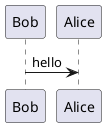

# UML

## 1. The World of Software Modeling

### 1.1. Modeling Languages

A model is a partial abstract representation of a real-world system. Modeling helps us analyze, communicate, test, and document our understanding of the system we are trying to build. It is a critical step, not only in software development, but in all fields of engineering. Let us take some examples of different types of models to appreciate their role.

First, the most sophisticated and very widely used are computational models that simulate time-varying behavior of a system. This system could be something that is already out there. For example, our weather forecasting system that gets data from our environment and simulates the weather in the future. Another example, is a car racing game that simulates some behavior of the real-world cars on the road. These are far more expensive to build and they are almost complete systems in themselves. Even though they model something, they are used as just that, and not as a step to build something else.

Second kind of models are analytical models, which are some mathematical equations to show relationships among certain variables in a system. For example, in banking you have a formula that calculates how much interest you will pay if you take a loan of X amount for Y number of years. It models how your liability will increase or decrease given X and Y variables.

The third kind, which is the one we are interested in, are nonanalytical, descriptive models. They help you describe the components within a system and how they are connected to each other. They are qualitative in nature in the sense that there are no numbers, but they give you a very good feel of what you want to build.

Unlike computational and analytical models that require high level of expertise in mathematics and computational sciences, the nonanalytical models are relatively easy to build and intuitive to understand. I'm sure you have seen some architectural layouts of a building. For the most part, we can understand the walls, and rooms, and hallways without much effort. We can also draw rough sketches ourselves.

In software world, these nonanalytical models can be roughly divided into two groups. Ones that model data, such as entity-relationship models that you may be familiar with, and the others that model the application that works on that data. UML model falls under this category, which means that while UML models refer to the data, they focus on modeling the logic and structure of the application that uses that data.

Examples of other similar modeling paradigms are SysML or Systems Modeling Language, and BPMN models. SysML is similar to UML, but a little more general purpose as it is about systems engineering and not specifically for software engineering. In fact there are quite a few common diagrams between UML and SysML. For example, use case diagram, activity diagram, and sequence diagram.

BPMN or Business Process Modeling Notation, is used for modeling business processes and workflows. This one also has some similarities with the flowcharting aspect of activity diagrams in UML. Unlike UML and SysML, that target software and system engineers, BPMN targets business stakeholders who focus on the domain knowledge and organizational systems.

Unified Modeling Language is a family of graphical notations to describe and design software systems, especially those using object-oriented approach. The notations and their meanings are defined by a computer industry standard consortium called as Object Management Group or OMG. You can find out more about the UML standards. There have been several releases of UML. And the most recent was 2.5 that was released in 2015. The SysML and BPMN modeling standards are also governed by OMG.

### 1.2. Types of UML Models

UML notations are grouped under three different types of diagrams. The first is the set of those diagrams that model the structure of the system, and the second is the set that models the behavior of the system.

Each of these two has several types of diagrams showing different aspects of the system. The third set comes under the behavior category and models the interaction within and outside the system. All these three types put together make 13 types of UML diagrams.

The three categories of diagrams help us model different aspects of the system.

- Structural diagrams help us see the static view of the system in terms of its components. For example, class diagram is a structural diagram because it shows a static view of all the classes that will be created over the system.

- The behavioral diagrams show how the system and its components behave over time. For example, an activity diagram is a behavioral diagram that showcases the system's logical workflow.

- And interaction diagrams show interaction among the components of the systems identified in the structural diagram. For example, communication among the classes of a system. Interaction diagrams can also depict how the system as a whole interacts with its external entities.

While there are so many types of diagrams, and their notations and complexity can get very intricate, it is important to consider a few tips.

- First, you should model selectively. Remember that you're modeling to analyze, communicate, test, and document. Modeling is just a means to an end and not the end in itself. So, you should selectively identify which types of diagrams you really need to create, and you do not and should not draw all 13 diagrams as it is just an overkill.

- Second, model collaboratively. Models are thinking and communication tools. Create them and share them with your team to have a common understanding and agreement.

- Third, model smartly. Models are knowledge assets and with the entire team invest its time and expertise.

Keeping them handy and updated for future reference as your software design evolves is a great way to benefit from that investment. Having said that, it is easy to lose ourselves in the minutia of various diagrams. Do not spend too much time making them look perfect and pretty. Start on a white board or a piece of paper and keep it rough and fluid. Focus on what you are modeling and not the model itself. Once you have some basic semblance of the model, take a pick and go ahead with its implementation. As you will go through iterations of design and implementation, your design will begin to solidify and that rough sketch will begin to stabilize. That then will be a good time to use a tool to capture the final design for future reference. But which tool? Well, that is what we will discuss next.

### 1.3. UML modeling tools

Computer-aided software engineering tools or Case Tools are very helpful across a variety of tasks in software development life cycle. Such as modeling, code generation, reverse engineering, analyzing code complexity, calculating metrics and so on.

You don't need to use these tools when you are just starting to draw these diagrams because modeling is a creative activity and you will need to draw many rough sketches on a piece of paper or whiteboard before you are ready to transfer them into a tool.

But in the long run some of these tools can be very helpful when you need to create complex models and keep them updated on an on-going basis as a knowledge asset for your team.

Wikipedia shows close to fifty tools that are in the market with variety of propriety as those open source tools. For example Visual Paradigm and PlantUML that are open source and Microsoft Visio and IBM Rational Rose are proprietary. LinkedIN library has several courses on Microsoft Visio tools so feel free to look them up.

I will show you some examples of using PlantUML which is different from other drawing tools you may have seen.

- PlantUML is an open-source tool to create UML diagrams from a plain text language which is a form of application specific or domain specific language. What this means is that you specify what you want to draw in words and the tool draws that for you.

- PlantUML can be run directly through a command line or used with many tools such as Eclipse, or intelligent IDE's, Maven build framework, Java docs and Microsoft Word through add-in's and plug-in's. If you do not like the idea of drawing tools and feel more at home with scripts, then

- PlantUML is a good option for you to explore. It offers an online server where you can try out different scripts.

Let us take a quick look at two examples.

Aligning text in native markdown is not possible. However, you can align the text using inline HTML tags.

- The sequence diagram shows Bob sending a message 'Hello' to Alice. Since we have not discussed different notations and UML diagrams, it will not make much sense to you at this time but what is important to learn here is the ease of using text to generate diagrams.

![alt text][logo]

- Here is another example, this time off a Use Case diagram.

Here the script models two actors and one Use Case within the system being modeled. As you can see PlantUML is a fairly sophisticated tool to draw complex UML diagrams and if you're interested PlantUML offers an easy to understand documentation to help you get started. Although learning PlantUML is not within the scope of this course, you may want to know that I have used PlantUML to draw most of the UML diagrams that you will see in this course.

## 2. Getting Started

### 2.1. Use Case Diagram

### 2.2. Activity Diagram

### 2.3. Class Diagrams: Key Elemenets

### 2.4. Class Diagrams: Classifiers and Features

### 2.5. Class Diagrams: Relationships

### 2.6. Sequence and Communication Diagram

### 2.7. Challenge: Name

### 2.8. Solution: Name

## 3. Digging Deeper into Details

### 3.1. Object Diagram

### 3.2. State Machine Diagram

### 3.3. Component Diagram

### 3.4. Package Diagram

### 3.5. Deployment Diagram

### 3.6. Challenge: Name

### 3.7. Solution: Name

## 4. Some Special Cases

### 4.1. Interaction Overview Diagram

### 4.2. Composite Structure

### 4.3. Timing Diagrams

### 4.4. Challenge: Name

### 4.5. Solution: Name

[logo]: ./images/img_1_use_case_diagram_simple.png "Logo Title Text 2"
